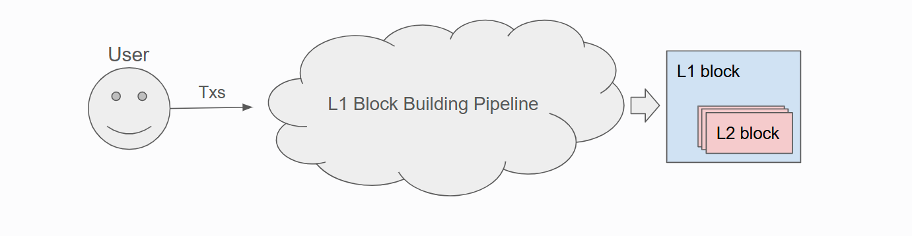
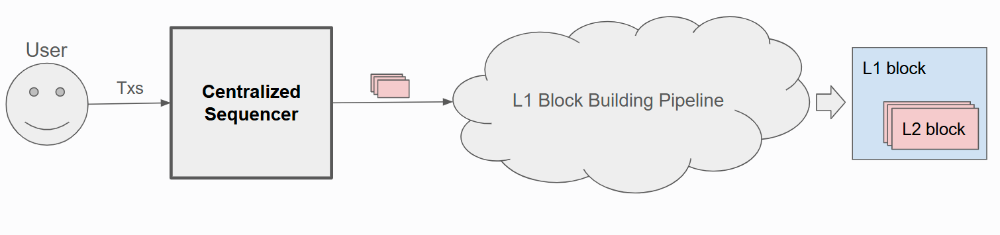

# Based Rollups

## What Are Based Rollups, and Why Do They Matter?

Based rollups are an approach to Layer 2 scaling where the **centralized sequencer** is removed entirely. Instead of a
single entity controlling transaction ordering, Ethereum’s own Layer 1 block-building process handles the job. This
design is closely tied to [Proposer-Builder Separation (PBS)](https://ethereum.org/en/roadmap/pbs/), a concept in
Ethereum’s roadmap that aims to keep block-building open and permissionless.

### The Problem with Conventional Rollups

Traditional rollups often rely on a centralized sequencer. Although this setup reduces latency and can lower transaction
costs, it also:

- Introduces a single point of failure.
- Exposes users to potential censorship and transaction reordering.
- Consolidates power in the hands of the sequencer.

### How Based Rollups Address This

By tying L2 transaction ordering directly to Ethereum’s decentralized block builders, based rollups inherit Ethereum’s
own security and censorship-resistance guarantees:

- **No Central Authority**: The L1 block-building process takes responsibility for ordering transactions, eliminating
  the centralized sequencer.
- **Censorship Resistance**: If Ethereum itself is censorship-resistant, based rollup transactions inherit the same
  censorship resistance as Ethereum.
- **Better Alignment With Ethereum**: Validators, builders, and searchers collectively maintain both L1 and L2
  transaction inclusion, strengthening decentralization.

### Why Surge Uses a Based Rollup Model

Surge fully embraces this model for its rollup architecture. By integrating with Ethereum’s existing infrastructure:

- L2 transactions enter the **same permissionless block-building pipeline** as L1.
- Surge becomes **as decentralized as Ethereum itself**, preserving user trust and security.

## Comparing Based and Non-Based Rollups

- **Based Rollups**: Transaction ordering is done by Ethereum’s decentralized validators and block builders, leveraging
  PBS to maintain fairness and trustlessness.

- **Conventional Rollups**: A centralized sequencer has the final say on transaction order before batches go to L1,
  introducing potential risks of manipulation or censorship.

## Further Reading

To learn more about Based Rollups, explore these helpful resources:

- **Taiko Documentation: [Based Rollups](https://docs.taiko.xyz/taiko-alethia-protocol/protocol-design/based-rollups)**  
  Official documentation providing an in-depth understanding of Taiko's Based Rollups design and protocol
  specifications.
- **Blog Post: [Understanding Based Rollups](https://taiko.mirror.xyz/7dfMydX1FqEx9_sOvhRt3V8hJksKSIWjzhCVu7FyMZU)**  
  A clear and informative article by the Taiko team, offering valuable insights into how Based Rollups function and
  their benefits.
