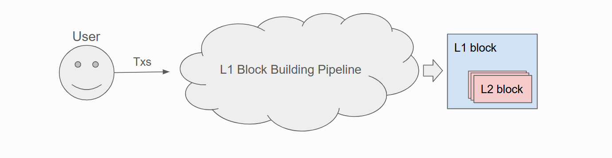
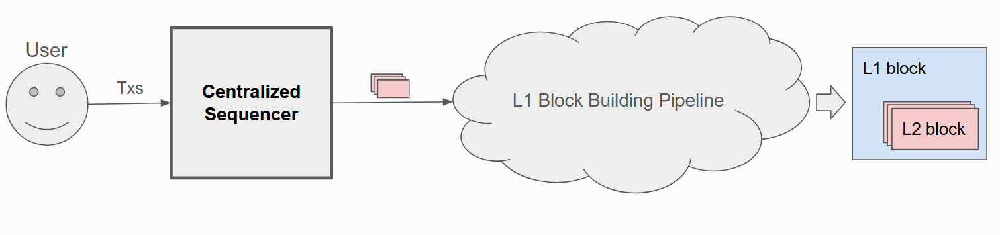

# Based Rollups

## What Is a Based Rollup?

A based rollup removes the centralized sequencer entirely. Instead of one entity deciding transaction ordering, Ethereum's own L1 block-building process does it. This ties directly into [Proposer-Builder Separation (PBS)](https://ethereum.org/en/roadmap/pbs/).

### The Problem with Conventional Rollups

Most rollups use a centralized sequencer. This gives you low latency, but:

- Single point of failure
- Censorship and reordering risk
- One entity controls transaction ordering

### How Based Rollups Fix This

L2 transaction ordering is handled by Ethereum's decentralized block builders:

- **No central authority** -- L1 block builders order transactions, not a single sequencer
- **Censorship resistance** -- if Ethereum is censorship-resistant, so is the rollup
- **Alignment with Ethereum** -- validators, builders, and searchers handle both L1 and L2 inclusion

### Why Surge Is Based

Surge uses this model. L2 transactions go through the same permissionless block-building pipeline as L1. The `RealTimeInbox.propose()` contract on L1 is fully permissionless -- anyone with a valid ZK proof can call it. There's no proposer whitelist or access control at the protocol level.

## Based Sequencing + Real-Time Proving

These are two separate things that work together:

| Concern | What It Means | Surge's Approach |
|---------|--------------|-----------------|
| **Sequencing** (who orders txs) | Who decides which transactions go in which block | Based -- L1 validators, not a centralized sequencer |
| **Proving** (when proofs happen) | How and when blocks are proven valid | Real-time -- ZK proof in ~10-17s, submitted atomically with the proposal |

The real-time proving change (Pacaya → RealTime fork) didn't change the sequencing model. It changed the *proving* model: from two-phase (propose now, prove within 24h) to atomic (propose + prove in one transaction). The permissionless nature of proposing was preserved -- and actually simplified, since bonds and prover whitelists were removed.

## Comparing Based and Non-Based Rollups

**Based rollups:** Transaction ordering by Ethereum's validators and block builders via PBS.

**Conventional rollups:** A centralized sequencer decides transaction order before batching to L1.

## Further Reading

- [Real-Time Proving](./real-time-proving) -- how the proving model works (orthogonal to based sequencing)
- [Surge Architecture](./architecture) -- how all the components fit together
- [Taiko: Based Rollups](https://docs.taiko.xyz/taiko-alethia-protocol/protocol-design/based-rollups) -- Taiko's based rollup design (Surge is built on Taiko)
- [Understanding Based Rollups](https://taiko.mirror.xyz/7dfMydX1FqEx9_sOvhRt3V8hJksKSIWjzhCVu7FyMZU) -- Taiko team's explainer
