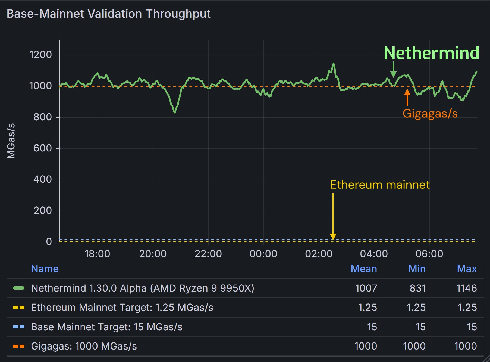

# Gigagas in Surge

Surge Rollup is built on the Nethermind client, chosen for its proven performance at gigagas scale throughput. Compatible across based, optimistic, and custom EVM rollups, it enables fast, reliable execution without compromise. [Learn more about Nethermind Execution Client](https://github.com/NethermindEth/nethermind).

## What is Gigagas?

If you’re new to Gigagas, think of it as a way to measure how fast an Ethereum client can process transactions. Ethereum transactions consume "gas", a unit that represents the computational effort required to execute operations. Gigagas (GPS) measures how many millions of gas units a client can process per second. 

For example:
- A client processing **1 Gigagas per second** can handle transactions consuming 1 million gas units in one second.
- Higher Gigagas performance means faster transaction processing, better scalability, and lower costs for users.

## What Makes Gigagas Important?

Gigagas is critical for evaluating the performance of rollups and execution clients. A higher Gigagas score means:

- **Faster Transactions:** More transactions can be processed in less time.
- **Scalability:** The system can handle a growing number of users and applications without performance degradation.
- **Cost Efficiency:** Improved processing speeds result in lower transaction fees for users.

The graph above demonstrates the performance of the Nethermind Execution Client, achieving gigagas scale throughput. 

## Gigagas with the Nethermind Execution Client

The foundation of Gigagas performance in Surge lies in the **Nethermind Execution Client (NMC)**, a highly optimized Ethereum client designed to handle massive transaction throughput. The Nethermind Execution Client achieves Gigagas scale performance through the following features:

1. **Optimized Execution Engine:** The Nethermind Execution Client is designed to process transactions with minimal latency, ensuring high throughput.
2. **Optimized Database Access:** The client reduces the overhead of reading and writing state data during transaction execution.
3. **Parallel Processing:** By utilizing multithreading and parallel processing techniques, the client can handle multiple transactions simultaneously, further boosting performance.
